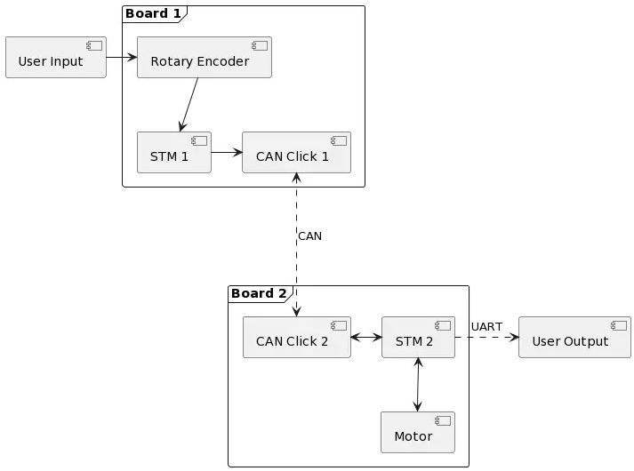

# ClickShield Peripherals
## RGB Led
Active Low, pinout:
- Red: PA6
- Green: PA8
- Blue: PA4

## Button
External Pullup, connected on Pin PA3

## Potentiometer
Connected on Pin PA7, which has AF for ADC\_IN7

# Clock config
## Bus clocks
- All buses have a fmax=80MHz.
- All AHB/APB prescalers divide by 1.

## PLL
- fin is 4Mhz to 16Mhz
- fvco is 64MHz to 344MHz
- M is 1 to 8
- R is 2,4,6,8
- N is 8 to 86
- SYSCLK source is PLLCLK

For SYSCLK=80MHz:
- M=4
- N=80
- R=4
- CLKSRC=HSI

# OS functions
## `os_init`
Initializes the clock system. Only to be called once, normally before the main 
call.

## `os_setcallback`
Set the function to be called on each event loop cycle. It works like the 
loop() function in arduino

## `os_timeout`
Allows for delaying the program flow, either by blocking (callback=NULL) or 
non-blocking behaviour. It takes a uint64, which shall contain the desired delay 
in nanoseconds.

It calculates the most accurate combination out of prescaler and counter reload. 
Its accuracy decreases by 1/fclk * floor(delay[ns]/2^32). So for the configured 
combination of fclk=80MHz, the achievable jitter(for identical parameters) is +- 
12.5ns. The absolute accuracy for function call to function return is of course 
in the range of a few dozen processor cycles, depending on compiler 
optimization, previous instruction pipelining, memory access barriers as well as 
other interrupts firing between timeout call and actual timer start.

Concerning longer delays (minute to hour range), the temperature stability of 
the system oscillator plays an increasignly larger role. One degree of 
temperature change results in an oscillator frequency change of a few ppm (let's 
say 2ppm/degC). So for a fclk=80MHz the deviation from one degree of temperature 
change has the same effect as the timer inaccuracies for a delay of 600 hours.

## `os_setalarm`
Provides a timeout callback variant similar to the `os_timeout` function.
In contrast to the above, it allows for multiple simultaneous timers (set via 
`OS_MAX_TIMERS`), but has a fairly low accuracy (+- 1ms) as it uses the sytick 
timer.

# Serial Console
## Format specification
## Implemented commands
- h -> returns help

## Implementation notes
For both RX and TX, DMA instance 1 will be used.
The RX channel will get medium priority, the TX channel will get low priority.

# How To
## Makefile
The makefile contains the following commands:
- build -> creates the .elf and .bin file from source
- clean -> clears all temporary files
- flash -> flashes the bin file via st-util

## Serial Console
Because of the whack specification, minicom does not handle the crlf lf etc 
translation correctly. Therefore, it is advisable to use the program *picocom* 
with the command `picocom -b 115200 --parity n --omap crlf --imap lfcrlf --echo
/dev/ttyUSB0`.

# Project
The idea of the project is to devise your own individual embedded project using 
the evaluation board and one or a few sensors and actuators

The overall project consists of two stm32l4 controllers, connected via a
CAN-shield on either side. One uC is connected to a stepper motor, the other uC 
is connected to a rotary encoder.

The user shall be able to request a change of stepper position via the encoder, 
which shall be transmitted to the stepper-uC and executed. The current position 
and movement state shall be sent back to the uC for display to the user.

## Click shield connections
Rotary encoder:
- A - PA1 - TIM2CH1 - AF1
- B - PA5 - TIM2CH2 - AF1
- BUTTON - PA4 - Pullup required
- RESET - PC15 - Active Low
- MOSI - PB5
- MISO - PB4
- SCK - PB3
- CS/LATCH - PA6

SPI1 -> AF5, SPI3 -> AF6, Shift Reg max frequency 25MHz

Stepper Motor:
- STEP - PB1 - TIM1CH3N
- DIR - PB0 - TIM1CH2N
- MS1 - PA0
- MS2 - PC14
- EN - PA3 - Not Connected

CAN Shield:
- RX - PA11 - AF9
- TX - PA12 - AF9

> [Diagram Image 
Link](//www.plantuml.com/plantuml/png/PP0n2uCm58Jt_8fNzmfc52bQwT315gnE8YAQqb9DIen3AVtlVGdDyEWKxlZktf5qCRqswponZRc9MK0dbHGTk-eUHR1NlHuX2k3Dcb8X-eA37DGeTCkQIrL0X6-UdI2VxiF3gW-DSXjr92UaLOKoIjj4Koz2mr4-LzF2TWV_fwY1aANyVVUw89r252HX61A2jn03IaQzn5VpNxNpqFHxlMdRtF3pQjpo6Egih5Wgv8WV-WK0)

## Runtime
The runtime code handles the initialization as well as the recurring control 
loop handler calls. The whole system is event driven, possible can errors are 
reported on the serial link.

## Encoder
The encoder library provides an interface to read the encoder position, which is 
detected in hardware with the help of a timer. Furthermore, the library allows 
to set a indicated position on the LED ring, with an optional blink mode.

## Stepper
The stepper library provides an interface to move the stepper motor to a 
designated position. The movement itself is made asynchroneously with the help 
of a timer. A function to get the current position(also during movement, with 
reduced accuracy) is also available.

## CAN Interface

Das kann Interface wurde so aufgebaut, dass man damit ein Package bestehend aus folgenden Instanzen versenden kann.

- `uint32_t id`
- `uint8_t *data`
- `uint8_t len`

In der Library wurden insgesamt fünf Error-Codes definiert die über eine Funktion ausgelesen werden können.
- `CAN_ERROR_NONE`
- `CAN_ERROR_EPV`
- `CAN_ERROR_BOF`
- `CAN_ERROR_STF`
- `CAN_ERROR_FOR `

Das Interface ist so aufgebaut, dass man mit Hilfe von Callbackfunktionen die verschiedenen Zustände verarbeiten kann.
Für die bessere Handhabung der Callbacks ist in der Library eine Funktion 
vorgesehen die die Functionpointer mit der richtigen ID in eine Array speichert.
Weiters kann neben dem typschen Versenden und Empfangen auch abgefragt werden 
welche Mailbox gerade frei ist.
